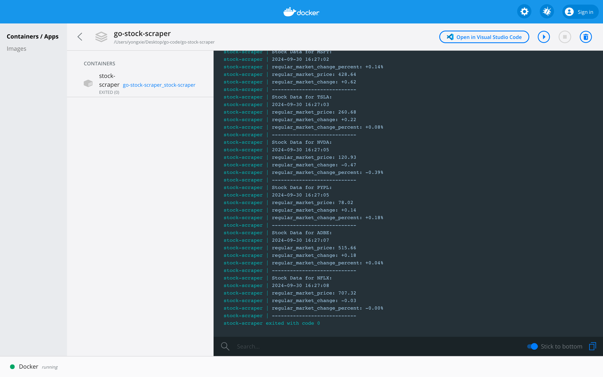

# Go Stock Scraper

**A fast Go-based stock scraping tool** that fetches real-time stock data (price, market change, and percentage change) from Yahoo Finance using the Colly web scraping framework. 

## Features 
- Scrapes real-time stock data from Yahoo Finance. 
- **Concurrency with Goroutines**: Utilizes Go's
goroutines to scrape multiple tickers in parallel, making it extremely fast and efficient. 
- Easily modify the list of tickers by editing a simple text file (`tickers.txt`). 
- Outputs stock data with a timestamp. 

## Project Basic Structure 
``` 
. 
├── Dockerfile  # Docker configuration for containerization 
├── go.mod      # Go module dependencies 
├── main.go     # Entry point of the Go application 
├── scraper/    # Contains scraping logic 
├── utils/      # Utility functions (timestamp, file reading) 
├── tickers.txt # List of stock ticker symbols 
├── README.md   # Project documentation (this file) 
```

## Prerequisites 

To run this project, you need: 
- **Go 1.20 or later** 
- **Docker** (optional, if running inside a container) 

## How it Works 

This stock scraper reads ticker symbols from `tickers.txt` and
uses **goroutines** to scrape the stock data in parallel. This parallelism greatly improves execution speed, especially when scraping multiple stocks at once. 

For each ticker, the application scrapes the following data: 
- **Regular market price** 
- **Regular market change** 
- **Regular market change percentage** 

## Setup Instructions 

### 1. Running Locally 
1. Install Go 1.20+: [Go Installation](https://golang.org/doc/install) 
2. Clone this repository: 
```bash 
git clone https://github.com/yourusername/go-stock-scraper.git cd go-stock-scraper 
``` 
3. Install dependencies:
```bash 
go mod tidy 
``` 
4. Modify `tickers.txt` to include your list of ticker symbols (one per line): 
```
AAPL GOOGL MSFT TSLA 
``` 
5. Run the application: 
```
bash go run main.go 
``` 

### 2. Running with Docker Compose
If you prefer to use Docker Compose for easier management, you can use the included docker-compose.yml file.

Running the Application:
```bash
docker-compose up --build
``` 

This will build the image and run the application in a container, automatically scraping stock data based on the tickers in tickers.txt.

Here is an example: 




## Performance 
The application leverages **goroutines**, Go's built-in
concurrency feature, allowing it to scrape multiple stock tickers simultaneously. This parallel scraping makes the tool significantly faster than sequential scraping methods, especially when handling a large number of tickers. 

For example, scraping 10 tickers in parallel can be done in nearly the same amount of time as scraping 1 ticker! 

## Contributing 
1. Fork the repository. 
2. Create a new branch: `git checkout -b feature/your-feature`. 
3. Make your changes. 
4. Commit your changes: `git commit -m 'Add feature'`. 5
. Push to the branch: `git push origin feature/your-feature`. 
6. Open a pull request. 

## License 
This project is licensed under the MIT License - see the [LICENSE](LICENSE) file for details.